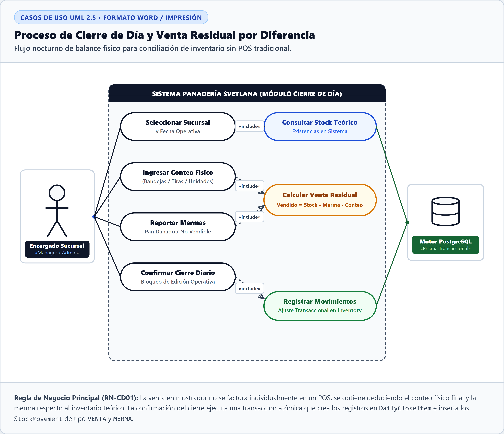
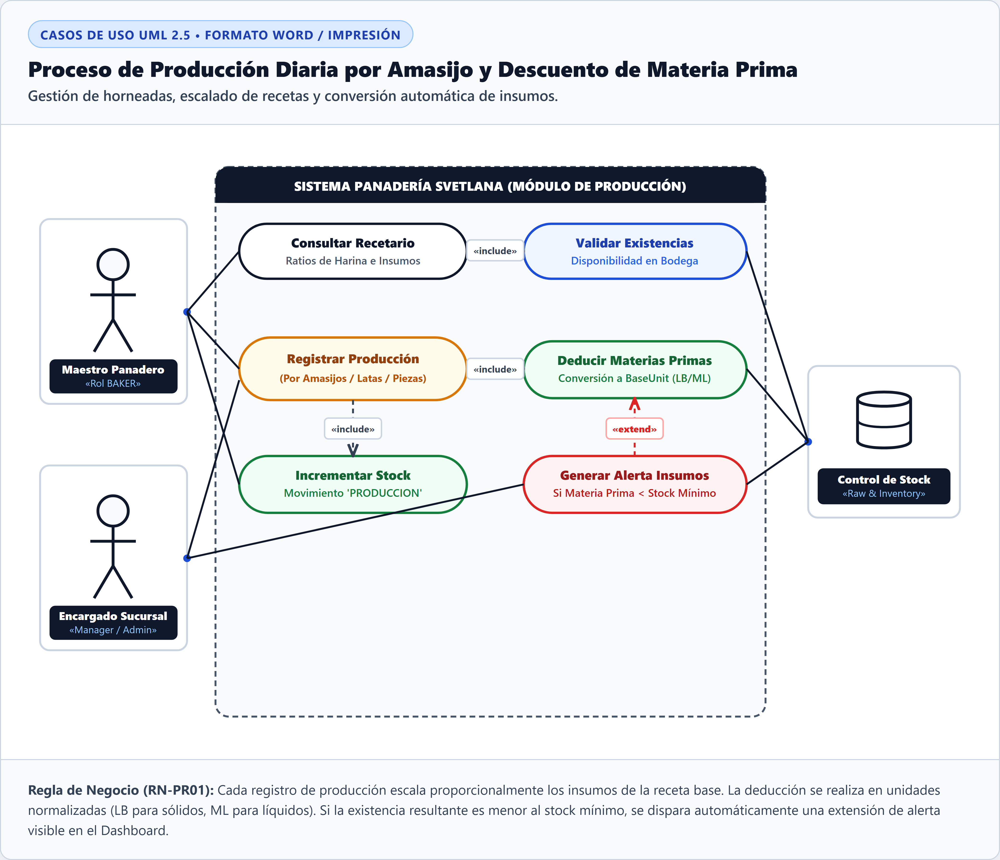
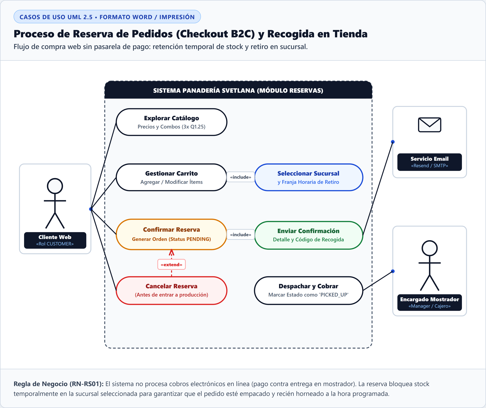
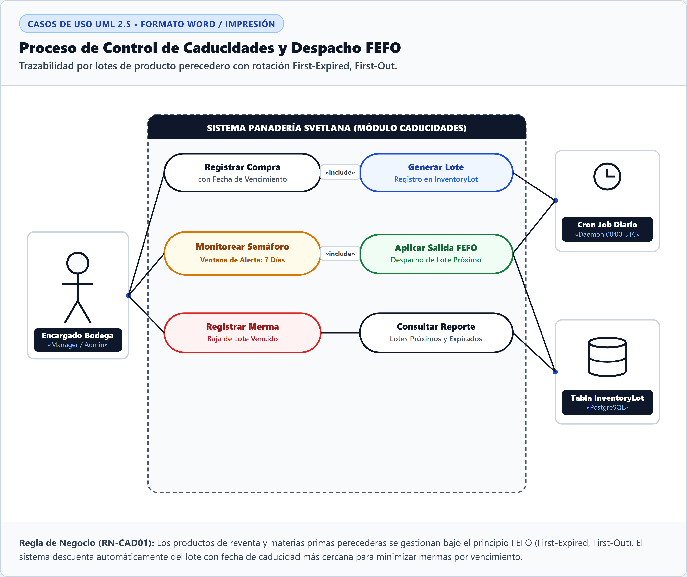
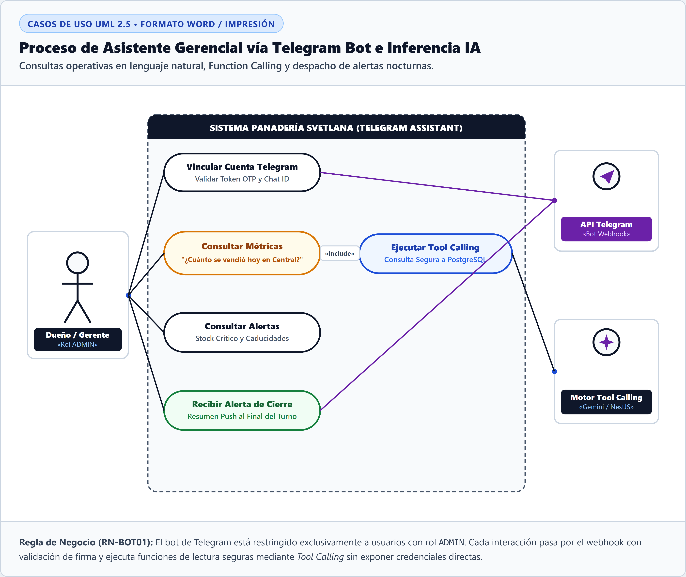
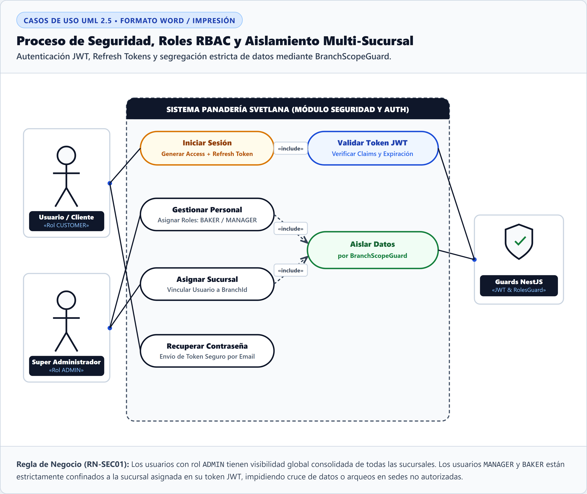

# Especificación y Documentación de Diagramas de Casos de Uso (UML 2.5)

> **Documento Técnico para Memoria de Tesis / Proyecto de Graduación**  
> **Sistema:** Plataforma Web de Gestión Operativa, Inventario y Reservas — *Panadería Svetlana*  
> **Estándar de Modelado:** Unified Modeling Language (UML) versión 2.5 (Object Management Group - OMG)  
> **Formato de Citas y Figuras:** Normas APA 7.ª edición  

---

## 1. Introducción y Marco Metodológico

El modelado del comportamiento funcional del sistema se realizó mediante **Diagramas de Casos de Uso**, cuyo propósito formal es delimitar la frontera del sistema (*System Boundary*), identificar los actores humanos y automatizados que interactúan con la plataforma, y definir las secuencias de acciones orientadas a satisfacer las reglas de negocio del negocio panadero.

Para asegurar rigor metodológico y trazabilidad arquitectónica, se aplicaron los siguientes estándares en todas las representaciones:
- **Actores Primarios e Interacciones Humanas:** Usuarios autenticados bajo el esquema de control de acceso basado en roles (*Role-Based Access Control* - RBAC): `ADMIN`, `MANAGER`, `BAKER` y `CUSTOMER`.
- **Actores Secundarios y Sistemas de Soporte:** Servicios en segundo plano (*Cron Jobs*), motores de base de datos relacional (*PostgreSQL/Prisma*), servidores SMTP de correo transaccional (*Resend*), pasarelas de mensajería (*API Telegram Bot*) y motores de inferencia con llamadas a herramientas (*AI Tool Calling Engine*).
- **Relaciones de Dependencia:**
  - `«include»`: Indica obligatoriedad funcional e inclusión atómica dentro del caso de uso base.
  - `«extend»`: Indica comportamiento condicional u opcional que enriquece el caso de uso base únicamente ante la presencia de un evento específico (e.g., alertas de umbral mínimo, cancelaciones de órdenes).

---

## 2. Matriz General de Diagramas de Casos de Uso

**Tabla 1**  
*Matriz Consolidada de Casos de Uso del Sistema Panadería Svetlana*

| ID | Nombre del Proceso | Actores Primarios | Actores Secundarios / Sistema | Casos de Uso Involucrados | Regla de Negocio Principal |
|---|---|---|---|---|---|
| **CU-01** | Cierre de Día y Venta Residual | Encargado Sucursal (`MANAGER` / `ADMIN`) | Motor PostgreSQL (Prisma ORM) | Seleccionar Sucursal, Consultar Stock Teórico, Ingresar Conteo Físico, Reportar Mermas, Calcular Venta Residual, Confirmar Cierre Diario, Registrar Movimientos | **RN-CD01:** Conciliación residual por diferencia sin POS tradicional ($Vendido = Stock - Merma - Conteo$). Transacción ACID. |
| **CU-02** | Producción Diaria y Materia Prima | Maestro Panadero (`BAKER`), Encargado Sucursal | Control de Stock (`Raw & Inventory`) | Consultar Recetario, Validar Existencias, Registrar Producción, Deducir Materias Primas, Incrementar Stock, Generar Alerta Insumos | **RN-PR01:** Escalado proporcional por batch de amasijo, conversión a unidad base (`BaseUnit`), alerta de quiebre de stock. |
| **CU-03** | Reserva de Pedidos y Recogida | Cliente Web (`CUSTOMER`) | Servicio Email (SMTP), Encargado Mostrador | Explorar Catálogo, Gestionar Carrito, Seleccionar Sucursal, Confirmar Reserva, Enviar Confirmación, Despachar y Cobrar, Cancelar Reserva | **RN-RS01:** Bloqueo temporal de inventario, pago contra entrega en mostrador (sin pasarela bancaria externa), ciclo de vida `PENDING` $\rightarrow$ `PICKED_UP`. |
| **CU-04** | Control de Caducidades (FEFO) | Encargado Bodega (`MANAGER` / `ADMIN`) | Cron Job Diario (00:00 UTC), Tabla `InventoryLot` | Registrar Compra, Generar Lote, Monitorear Semáforo, Aplicar Salida FEFO, Registrar Merma, Consultar Reporte | **RN-CAD01:** Despacho prioritario del lote con vencimiento más próximo (*First-Expired, First-Out*) y semáforo preventivo a 7 días. |
| **CU-05** | Asistente Gerencial Telegram Bot | Dueño / Gerente (`ADMIN`) | API Telegram Webhook, Motor Tool Calling (NestJS/Gemini) | Vincular Cuenta Telegram, Consultar Métricas, Ejecutar Tool Calling, Consultar Alertas, Recibir Alerta de Cierre | **RN-BOT01:** Acceso exclusivo a usuarios `ADMIN` validado por OTP/Chat ID; ejecución segura de lectura transaccional por llamadas a funciones. |
| **CU-06** | Seguridad, RBAC y Multi-Sucursal | Usuario / Cliente, Super Administrador | Guards NestJS (`JWT & RolesGuard`) | Iniciar Sesión, Validar Token JWT, Gestionar Personal, Asignar Sucursal, Aislar Datos, Recuperar Contraseña | **RN-SEC01:** Aislamiento estricto de ámbito por sucursal (`BranchScopeGuard`) para evitar acceso cruzado entre sedes no autorizadas. |

*Nota.* Matriz elaborada con base en los requerimientos funcionales del sistema. *Fuente: Elaboración propia (2026).*

---

## 3. Fichas Técnicas Detalladas por Proceso

---

### 3.1. Proceso de Cierre de Día y Venta Residual (CU-01)

**Figura 1**  
*Diagrama de Casos de Uso: Cierre de Día y Conciliación de Venta Residual*

#### Descripción Técnica del Proceso
El proceso de **Cierre de Día** representa el núcleo operativo nocturno de cada sucursal. Dado que la venta de pan al detalle no se registra unitariamente en un punto de venta (POS) convencional durante el día, el sistema calcula la venta neta consolidada a través de la fórmula matemática:

$$\text{Venta Neta} = \text{Inventario Inicial + Producción} - \text{Mermas} - \text{Conteo Físico Final}$$

#### Especificación de Casos de Uso

| Caso de Uso | Tipo | Actor | Descripción Operativa |
|---|---|---|---|
| **Seleccionar Sucursal** | Primario | Encargado Sucursal | Permite fijar la sede operativa y la fecha contable sobre la cual se registrará el balance. |
| **Consultar Stock Teórico** | `«include»` | Sistema / DB | Obtiene de la base de datos el saldo teórico acumulado hasta el momento del cierre. |
| **Ingresar Conteo Físico** | Primario | Encargado Sucursal | Captura el conteo de pan remanente mediante unidades de empaque (Bandejas, Tiras o Piezas sueltas). |
| **Reportar Mermas** | Primario | Encargado Sucursal | Registra las piezas de pan dañadas, quemadas o no aptas para la venta. |
| **Calcular Venta Residual** | `«include»` | Sistema Core | Ejecuta el algoritmo de conciliación que determina las unidades vendidas por diferencia. |
| **Confirmar Cierre Diario** | Primario | Encargado Sucursal | Sella la jornada contable bloqueando futuras ediciones en la fecha y sucursal. |
| **Registrar Movimientos** | `«include»` | Motor PostgreSQL | Ejecuta una transacción ACID que inserta `DailyCloseItem` y genera los `StockMovement` de salida (`VENTA` y `MERMA`). |

> **Nota.** Diagrama de casos de uso UML correspondiente al proceso de Cierre de Día y Conciliación de Venta Residual. Ilustra la interacción del actor *Encargado Sucursal* con los módulos de conteo físico y la persistencia transaccional en el *Motor PostgreSQL*.  
> *Fuente: Elaboración propia (2026).*

---

### 3.2. Proceso de Producción Diaria y Descuento de Materia Prima (CU-02)

**Figura 2**  
*Diagrama de Casos de Uso: Producción Diaria por Amasijo y Descuento de Materia Prima*

#### Descripción Técnica del Proceso
Modela la planificación, ejecución y costeo de horneadas en el taller de panadería. Al registrar una tanda de producción (por ejemplo, amasijos de 50 libras de harina o latas de piezas específicas), el sistema escala proporcionalmente todos los ingredientes de la receta base y descuenta las cantidades normalizadas del inventario de insumos.

#### Especificación de Casos de Uso

| Caso de Uso | Tipo | Actor | Descripción Operativa |
|---|---|---|---|
| **Consultar Recetario** | Primario | Maestro Panadero | Visualiza la formulación base y los ratios de equivalencia de harina e insumos secundarios. |
| **Validar Existencias** | `«include»` | Control de Stock | Comprueba que la bodega cuente con insumos suficientes antes de iniciar el horneado. |
| **Registrar Producción** | Primario | Maestro Panadero | Ingresa la cantidad de piezas, latas o amasijos producidos en la jornada. |
| **Deducir Materias Primas** | `«include»` | Control de Stock | Aplica la deducción automática en `RawMaterialInventory` en unidades normalizadas (`BaseUnit`: Libras o Mililitros). |
| **Incrementar Stock** | `«include»` | Control de Stock | Añade las unidades de producto terminado disponibles para venta en mostrador o reservas. |
| **Generar Alerta Insumos** | `«extend»` | Encargado Sucursal | Se dispara condicionalmente si el saldo resultante de una materia prima cae por debajo de su umbral mínimo de seguridad. |

> **Nota.** Diagrama de casos de uso UML correspondiente al proceso de Producción Diaria y Descuento de Materia Prima. Muestra la interacción de los actores *Maestro Panadero* y *Encargado de Sucursal* con la lógica de escalado de recetas y alertas de stock crítico.  
> *Fuente: Elaboración propia (2026).*

---

### 3.3. Proceso de Reserva de Pedidos en Línea y Recogida en Tienda (CU-03)

**Figura 3**  
*Diagrama de Casos de Uso: Reserva de Pedidos en Línea y Recogida en Tienda*

#### Descripción Técnica del Proceso
Describe la interacción B2C (*Business-to-Consumer*) que permite a los clientes particulares explorar el catálogo de panes tradicionales y combos promocionales, armar su carrito y programar la recogida en sucursal con pago contra entrega.

#### Especificación de Casos de Uso

| Caso de Uso | Tipo | Actor | Descripción Operativa |
|---|---|---|---|
| **Explorar Catálogo** | Primario | Cliente Web | Navega por categorías, precios individuales y reglas de combos (ej. 3 unidades por Q1.25). |
| **Gestionar Carrito** | Primario | Cliente Web | Agrega, incrementa o remueve productos verificando disponibilidad en tiempo real. |
| **Seleccionar Sucursal** | `«include»` | Cliente Web | Define la sede física de recogida y el horario estimado de retiro del pedido. |
| **Confirmar Reserva** | Primario | Cliente Web | Genera la orden con estado inicial `PENDING` y reserva el cupo de horneado. |
| **Enviar Confirmación** | `«include»` | Servicio Email | Envía un comprobante digital vía SMTP con el desglose del pedido y código de recogida. |
| **Despachar y Cobrar** | Primario | Encargado Mostrador | Entrega los productos empacados, recibe el pago en caja y actualiza la orden a `PICKED_UP`. |
| **Cancelar Reserva** | `«extend»` | Cliente Web | Permite cancelar la orden de forma voluntaria antes de que entre al ciclo de horneado. |

> **Nota.** Diagrama de casos de uso UML correspondiente al proceso de Reserva de Pedidos en Línea y Recogida en Tienda. Detalla el flujo comercial entre el *Cliente Web*, el *Servicio de Email* y el *Encargado de Mostrador*.  
> *Fuente: Elaboración propia (2026).*

---

### 3.4. Proceso de Control de Caducidades y Algoritmo FEFO (CU-04)

**Figura 4**  
*Diagrama de Casos de Uso: Control de Caducidades y Algoritmo FEFO*

#### Descripción Técnica del Proceso
Garantiza la trazabilidad sanitaria y minimiza las pérdidas por expiración de insumos perecederos y productos de reventa. Utiliza el algoritmo **FEFO** (*First-Expired, First-Out*), despachando siempre el lote con fecha de caducidad más cercana.

#### Especificación de Casos de Uso

| Caso de Uso | Tipo | Actor | Descripción Operativa |
|---|---|---|---|
| **Registrar Compra** | Primario | Encargado Bodega | Ingresa facturas de proveedores registrando cantidad y fecha de caducidad por ítem. |
| **Generar Lote** | `«include»` | Tabla `InventoryLot` | Crea registros particionados por lote para posibilitar el seguimiento cronológico. |
| **Monitorear Semáforo** | Primario | Encargado Bodega / Cron | Evalúa diariamente el estado de caducidad clasificando en Verde (>7 días), Amarillo (1-7 días) y Rojo (Vencido). |
| **Aplicar Salida FEFO** | `«include»` | Tabla `InventoryLot` | Prioriza la extracción física y lógica del lote más antiguo próximo a vencer. |
| **Registrar Merma** | Primario | Encargado Bodega | Da de baja lotes que alcanzaron su fecha de expiración sin haber sido consumidos. |
| **Consultar Reporte** | Primario | Encargado Bodega | Emite informes consolidados de mermas por vencimiento para auditoría administrativa. |

> **Nota.** Diagrama de casos de uso UML correspondiente al proceso de Control de Caducidades y Algoritmo FEFO. Representa el rol activo del *Cron Job Diario* y del *Encargado de Bodega* en la gestión de la tabla transaccional *InventoryLot*.  
> *Fuente: Elaboración propia (2026).*

---

### 3.5. Proceso de Asistencia Gerencial vía Telegram Bot (CU-05)

**Figura 5**  
*Diagrama de Casos de Uso: Asistente Gerencial y Monitoreo vía Telegram Bot*

#### Descripción Técnica del Proceso
Proporciona al dueño y personal directivo un canal de comunicación seguro y en tiempo real para supervisar ventas, cierres y existencias desde un chat de mensajería instantánea sin necesidad de acceder a la consola web completa.

#### Especificación de Casos de Uso

| Caso de Uso | Tipo | Actor | Descripción Operativa |
|---|---|---|---|
| **Vincular Cuenta Telegram** | Primario | Dueño / Gerente | Empareja el `ChatID` del usuario con su cuenta administrativa mediante un token OTP de un solo uso. |
| **Consultar Métricas** | Primario | Dueño / Gerente | Permite realizar preguntas libres en lenguaje natural (ej. "¿Cuánto vendió la sucursal Central hoy?"). |
| **Ejecutar Tool Calling** | `«include»` | Motor Tool Calling | El modelo de lenguaje interpreta la intención y ejecuta funciones tipadas de consulta en PostgreSQL. |
| **Consultar Alertas** | Primario | Dueño / Gerente | Solicita el listado de materias primas bajo el mínimo y productos por caducar. |
| **Recibir Alerta de Cierre** | Primario | Dueño / Gerente | Recibe automáticamente una notificación push consolidada cuando una sucursal finaliza su Cierre de Día. |

> **Nota.** Diagrama de casos de uso UML correspondiente al proceso de Asistencia Gerencial y Monitoreo vía Telegram Bot. Ilustra la integración de la *API Telegram Webhook* con el *Motor de Tool Calling* bajo autenticación estricta con rol *ADMIN*.  
> *Fuente: Elaboración propia (2026).*

---

### 3.6. Proceso de Seguridad, Control de Roles (RBAC) y Ámbito Multi-Sucursal (CU-06)

**Figura 6**  
*Diagrama de Casos de Uso: Seguridad, Control de Roles (RBAC) y Ámbito Multi-Sucursal*

#### Descripción Técnica del Proceso
Establece los límites perimetrales de acceso, autenticación mediante tokens criptográficos (*JWT*) y la partición lógica de información para impedir que los encargados de una sucursal manipulen datos de otra sucursal.

#### Especificación de Casos de Uso

| Caso de Uso | Tipo | Actor | Descripción Operativa |
|---|---|---|---|
| **Iniciar Sesión** | Primario | Usuario / Cliente | Valida credenciales hash (Bcrypt) y emite un par de tokens `AccessToken` y `RefreshToken`. |
| **Validar Token JWT** | `«include»` | Guards NestJS | Intercepta cada solicitud HTTP para verificar la firma, vigencia y claims del token. |
| **Gestionar Personal** | Primario | Super Administrador | Alta, baja y modificación de usuarios asignando roles específicos (`BAKER`, `MANAGER`). |
| **Asignar Sucursal** | Primario | Super Administrador | Vincula un identificador `BranchId` al usuario operativo. |
| **Aislar Datos** | `«include»` | Guards NestJS | Aplica el interceptor `BranchScopeGuard` inyectando filtros automáticos en las consultas a la base de datos. |
| **Recuperar Contraseña** | Primario | Usuario / Cliente | Envía un token temporal firmado por correo electrónico para restablecer la contraseña. |

> **Nota.** Diagrama de casos de uso UML correspondiente al proceso de Seguridad, Control de Roles (RBAC) y Ámbito Multi-Sucursal. Modela la interacción entre el *Super Administrador*, el *Usuario/Cliente* y los componentes de intercepción de seguridad *Guards NestJS*.  
> *Fuente: Elaboración propia (2026).*

---

## 4. Conclusiones y Trazabilidad con Requerimientos

La especificación de los 6 diagramas de casos de uso garantiza la cobertura integral de los requerimientos funcionales del sistema *Panadería Svetlana*:
1. **Desacoplamiento Operativo:** El proceso de cierre residual (`CU-01`) resuelve la problemática de inventarios sin imponer la carga de un POS individual.
2. **Eficiencia en Costos:** El módulo de producción (`CU-02`) y caducidades (`CU-04`) asegura la rentabilidad del negocio al mitigar mermas y sobrecostos.
3. **Omnicanalidad Segura:** El módulo de reservas (`CU-03`) y el asistente inteligente (`CU-05`) potencian las ventas y la toma de decisiones directiva bajo un esquema de seguridad perimetral robusto (`CU-06`).
