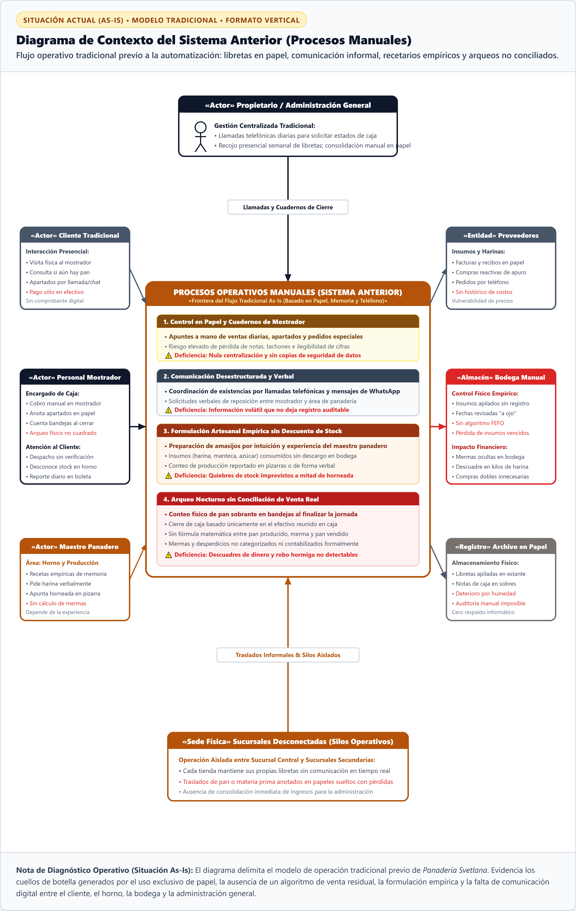

# Especificación del Diagrama de Contexto del Sistema Anterior (Situación As-Is)

> **Documento Técnico para Memoria de Tesis / Proyecto de Graduación**  
> **Tema:** Diagnóstico de Procesos Tradicionales Previos a la Automatización — *Panadería Svetlana*  
> **Estándar de Modelado:** Diagrama de Contexto del Sistema Tradicional (As-Is / Flujo Manual)  
> **Formato de Citas y Figuras:** Normas APA 7.ª edición  

---

## 1. Definición del Contexto Operativo Previo (Situación As-Is)

El **Diagrama de Contexto del Sistema Anterior (Modelo As-Is)** describe el flujo operativo y de comunicación tradicional que regía en *Panadería Svetlana* con anterioridad a la concepción e implementación de la plataforma web automatizada. 

Su propósito en la memoria de tesis es establecer la **línea base de diagnóstico**, delimitando formalmente la frontera de los procesos manuales (basados en papel, memoria humana y comunicación telefónica desestructurada) e identificando los actores y fuentes de datos que originaban cuellos de botella, quiebres imprevistos de inventario, pérdidas financieras por mermas no detectadas y falta de trazabilidad gerencial.

---

## 2. Representación Gráfica (APA 7)

**Figura 2**  
*Diagrama de Contexto del Sistema Anterior: Flujos de Información y Procesos Manuales Tradicionales en Panadería Svetlana*

> **Nota.** Diagrama de contexto del proceso tradicional (*As-Is*) que delimita la frontera operativa previa de la *Panadería Svetlana*. Se representan las interacciones entre los actores operativos (*Cliente Tradicional, Personal de Mostrador, Maestro Panadero y Administración General*) y las entidades físicas de soporte (*Proveedores Locales, Bodega Manual, Archivo Físico en Papel y Sucursales Desconectadas*), evidenciando los puntos de vulnerabilidad operativa generados por la ausencia de un software transaccional centralizado.  
> *Fuente: Elaboración propia (2026).*

---

## 3. Matriz de Entidades, Flujos Tradicionales y Deficiencias Detectadas

**Tabla 2**  
*Matriz de Actores, Entidades Externas, Canales Tradicionales y Puntos de Dolor Operativos*

| Entidad / Actor | Tipo | Canal Tradicional | Flujo de Entrada / Salida Manual | Deficiencias y Puntos de Dolor (Diagnóstico) |
|---|---|---|---|---|
| **Cliente Tradicional** | Actor Humano (Consumidor) | Presencial / Llamada telefónica | Consulta verbal de disponibilidad; apartado de producto en papelitos; pago exclusivo en efectivo en mostrador. | Incertidumbre sobre existencias; desplazamientos innecesarios a la tienda; pedidos apartados no reclamados sin penalización ni trazabilidad. |
| **Personal de Mostrador** (`Cajero / Despacho`) | Actor Humano (Operativo) | Libretas de papel / Boletas físicas | Cobro manual en mostrador; anotación en cuaderno de ventas; conteo visual nocturno de bandejas sobrantes. | Cálculos propensos a error humano; boletas ilegibles o extraviadas; arqueo de caja limitado al efectivo sin cruce contra el pan horneado. |
| **Maestro Panadero** | Actor Humano (Producción) | Pizarra / Solicitud verbal | Dosificación de recetas por memoria/experiencia; pedidos verbales de sacos de harina; apunte de latas horneadas en pizarra. | Falta de estandarización en recetas; consumo de materia prima no registrado; quiebres sorpresivos de insumos en plena madrugada. |
| **Propietario / Administración** | Actor Humano (Directivo) | Llamadas / Recojo físico semanal | Llamadas telefónicas diarias para pedir el saldo de caja; recolección física de cuadernos; sumatorias manuales en calculadora. | Cero visibilidad en tiempo real; consolidación de balances demorada por días; imposibilidad de auditar discrepancias o robo hormiga. |
| **Proveedores Locales** | Entidad Externa | Facturas físicas / Teléfono | Emisión de facturas y notas de entrega en papel; recepción de pedidos de compra de emergencia por desabastecimiento. | Compras reactivas sin planificación previa; falta de historial de precios y fluctuaciones de costos; desaprovechamiento de economías de escala. |
| **Bodega de Insumos** | Entidad Física (Almacén) | Inspección ocular aleatoria | Almacenamiento empírico de sacos y cajas; revisión de fechas de caducidad "a ojo" durante limpiezas esporádicas. | Inexistencia del algoritmo FEFO (*First-Expired, First-Out*); descomposición y caducidad oculta de insumos; compras duplicadas innecesarias. |
| **Archivo en Papel** | Soporte de Registro | Cuadernos y estantes físicos | Archivo de libretas de cierre, notas de pedidos y facturas acumuladas en carpetas y sobres de manila en la sucursal. | Deterioro por humedad, manchas de grasa o extravío de hojas; auditoría histórica casi inviable; vulnerabilidad ante pérdida total por siniestro. |
| **Sucursales Desconectadas** | Sedes Físicas (Silos) | Mensajes de chat / Cuadernos | Operación aislada en cada sede física; traslados informales de pan y materias primas anotados en hojas sueltas. | Silos operativos sin inventario cruzado; desbalance de existencias (sobrantes en una sede mientras en la otra hay desabastecimiento). |

---

## 4. Frontera y Análisis de Deficiencias del Proceso Manual

El análisis de la frontera del sistema anterior revela cuatro pilares críticos de ineficiencia operativa que justificaron el desarrollo del nuevo software:

1. **Dependencia Exclusiva del Soporte en Papel:**  
   La totalidad de los registros de ventas, apartados y turnos descansaba en libretas manuscritas. La falta de persistencia digital impedía generar reportes comparativos y exponía a la empresa a pérdidas irreparables de información.
2. **Ausencia del Algoritmo de Venta Residual:**  
   Al no disponer de un punto de venta (POS) automatizado, el cierre nocturno consistía únicamente en contar el dinero en gaveta. No existía la ecuación fundamental de deducción matemática ($\text{Venta} = \text{Stock Teórico} - \text{Conteo Físico} - \text{Merma}$), imposibilitando cuantificar el pan regalado, deteriorado o sustraído.
3. **Producción Empírica sin Descuento de Materia Prima:**  
   Los amasijos se ejecutaban sin un recetario maestro digitalizado. Los ingredientes salían de bodega sin rebajar un kardex centralizado, provocando desabastecimientos repentinos y mermas por sobreproducción.
4. **Desconexión Territorial y Falta de Supervisión Remota:**  
   La administración general carecía de canales automáticos para supervisar las sucursales. La toma de decisiones dependía de reportes verbales tardíos, mientras que los clientes no disponían de un canal web para reservar sus productos con certeza.
