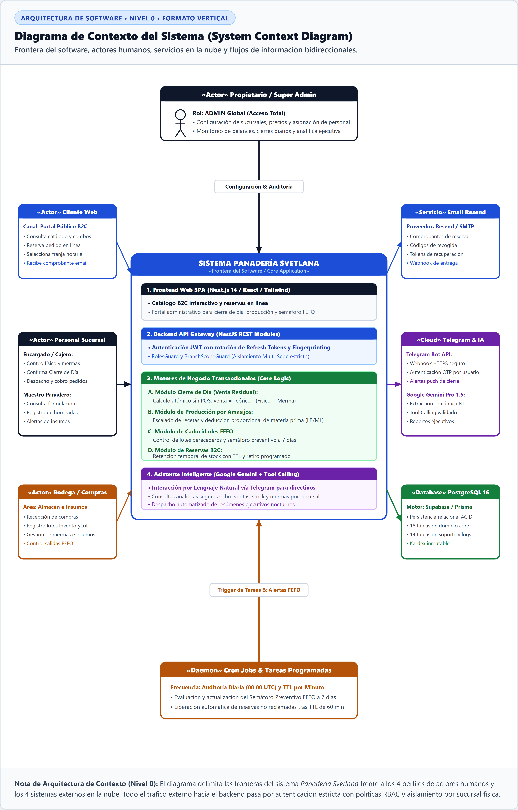

# Especificación del Diagrama de Contexto del Sistema (Nivel 0)

> **Documento Técnico para Memoria de Tesis / Proyecto de Graduación**  
> **Sistema:** Plataforma Web de Gestión Operativa, Inventario y Reservas — *Panadería Svetlana*  
> **Estándar de Modelado:** Diagrama de Contexto del Sistema (C4 Model Nivel 1 / UML System Boundary)  
> **Formato de Citas y Figuras:** Normas APA 7.ª edición  

---

## 1. Definición del Contexto y Alcance del Software

El **Diagrama de Contexto del Sistema** (Nivel 0 / Nivel 1 de Arquitectura C4) representa el punto de partida fundamental para la comprensión de la arquitectura de software. Su objetivo primordial es delimitar formalmente la **Frontera del Sistema** (*System Boundary*), distinguiendo los componentes que forman parte del desarrollo propio frente a los actores humanos y los servicios tecnológicos externos que interactúan con él.

---

## 2. Representación Gráfica (APA 7)

**Figura 1**  
*Diagrama de Contexto del Sistema: Interacción de Actores y Servicios Externos con la Plataforma Panadería Svetlana*

> **Nota.** Diagrama de contexto del sistema (*System Context Diagram*) que delimita la frontera del software de la *Panadería Svetlana*. Se representan los cuatro perfiles de actores humanos principales (*Cliente Web, Personal de Sucursal, Encargado de Bodega y Propietario/Super Admin*) y los cuatro sistemas externos integrados (*Servicio Email Resend/SMTP, Plataforma Telegram Bot & Motor de IA, Base de Datos PostgreSQL/Prisma y Demonio de Tareas Cron*), detallando los flujos de entrada y salida de datos.  
> *Fuente: Elaboración propia (2026).*

---

## 3. Matriz de Entidades y Flujos de Información

**Tabla 1**  
*Especificación de Actores, Sistemas Externos y Canales de Comunicación del Contexto*

| Entidad | Tipo | Canal / Protocolo | Información de Entrada (Hacia el Core) | Información de Salida (Desde el Core) |
|---|---|---|---|---|
| **Cliente Web (Consumidor)** | Actor Humano (B2C) | HTTPS / Web Pública (Next.js) | Consulta de catálogo y combos; selección de productos; horario y sucursal de retiro; confirmación de orden de reserva. | Catálogo dinámico con disponibilidad; estado de la reserva; código alfanumérico único para recogida en tienda. |
| **Personal de Sucursal** (`MANAGER` / `BAKER`) | Actor Humano (Operativo) | HTTPS / Portal Administrativo | Conteo físico nocturno; registro de mermas; confirmación de cierre diario; despacho y cobro de pedidos; registro de producción por amasijo. | Saldo teórico de stock; cálculo de venta residual; recetario base proporcional; alertas de quiebre de materias primas. |
| **Encargado de Bodega** | Actor Humano (Logística) | HTTPS / Módulo Inventarios | Recepción de facturas de compra; registro de insumos con fecha de vencimiento; bajas por caducidad. | Semáforo preventivo de vencimientos (ventana de 7 días); reportes de consumo ordenados bajo algoritmo FEFO. |
| **Propietario / Super Admin** | Actor Humano (Directivo) | HTTPS / Dashboard Global | Configuración multi-sucursal; creación de usuarios y asignación de roles RBAC; auditoría de operaciones. | Métricas financieras consolidadas en tiempo real; balances comparativos entre sucursales; reportes históricos. |
| **Servicio Email Transaccional** | Sistema Externo | REST API / SMTP (Resend) | Webhook de confirmación de entrega y rebote (*Delivery / Bounce events*). | Solicitud de envío de comprobantes de reserva con código de retiro; tokens criptográficos para restablecimiento de contraseña. |
| **Telegram Bot & Motor IA** | Sistema Externo / IA | HTTPS Webhook / Gemini API | Consultas gerenciales en lenguaje natural (ej. *"¿Cuánto vendió Central hoy?"*); comandos directos `/resumen`. | Respuestas estructuradas mediante *Tool Calling*; alertas push inmediatas al finalizarse un Cierre de Día. |
| **Base de Datos PostgreSQL** | Sistema Externo (Persistencia) | TCP Connection Pool (Prisma ORM) | Confirmación de transacciones atómicas (ACID); datasets de inventario, cierres, órdenes y movimientos históricos. | Consultas SQL parametrizadas; inserción y actualización de registros con partición por `branchId`. |
| **Cron Jobs / Daemons** | Servicio Automatizado | Scheduler Interno (Node.js / OS) | Señal de ejecución periódica (*Trigger diario a las 00:00 UTC*). | Actualización del semáforo de lotes (`InventoryLot`); disparo de alertas automáticas de insumos perecederos. |

---

## 4. Frontera y Subsistemas Internos del Core

El núcleo del software (*Core Application*) se organiza en cuatro capas de responsabilidad desacopladas:

1. **Frontend Web SPA (Next.js / React / Tailwind CSS):** Interfaz gráfica responsiva que provee dos experiencias de usuario diferenciadas: el catálogo público de autoservicio para clientes y el panel de control administrativo para el personal.
2. **Backend API Gateway (NestJS REST Framework):** Capa de control de acceso perimetral encargada de la autenticación mediante tokens criptográficos JWT (`AccessToken` y `RefreshToken`), validación de roles (`RolesGuard`) y aislamiento de datos por sucursal (`BranchScopeGuard`).
3. **Módulos de Lógica de Negocio:** Motores que encapsulan las reglas críticas de la empresa:
   - *Algoritmo de Venta Residual:* Cálculo matemático nocturno de venta por diferencia ($Vendido = Stock - Merma - Conteo$).
   - *Motor de Producción:* Escalado volumétrico de materias primas por amasijo y conversión a unidades base (`BaseUnit`).
   - *Algoritmo FEFO:* Asignación y despacho de lotes priorizando fechas de expiración inminentes.
4. **Motor Asistente Inteligente (AI Tool Calling Engine):** Capa de integración que traduce el lenguaje natural en consultas SQL seguras y parametrizadas sin exponer credenciales directas de base de datos.
