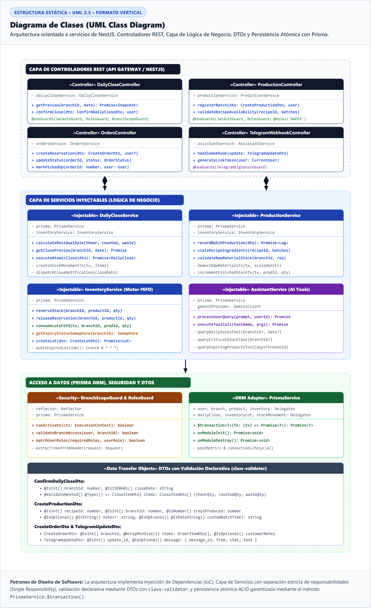
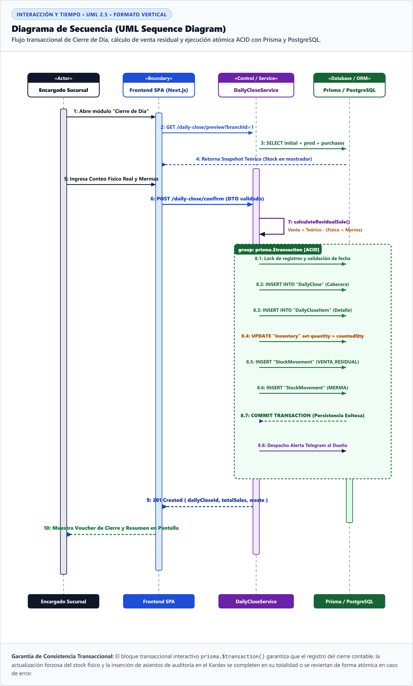
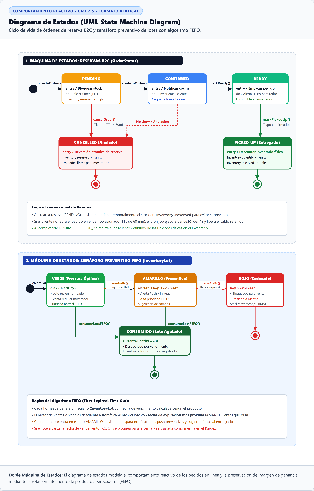
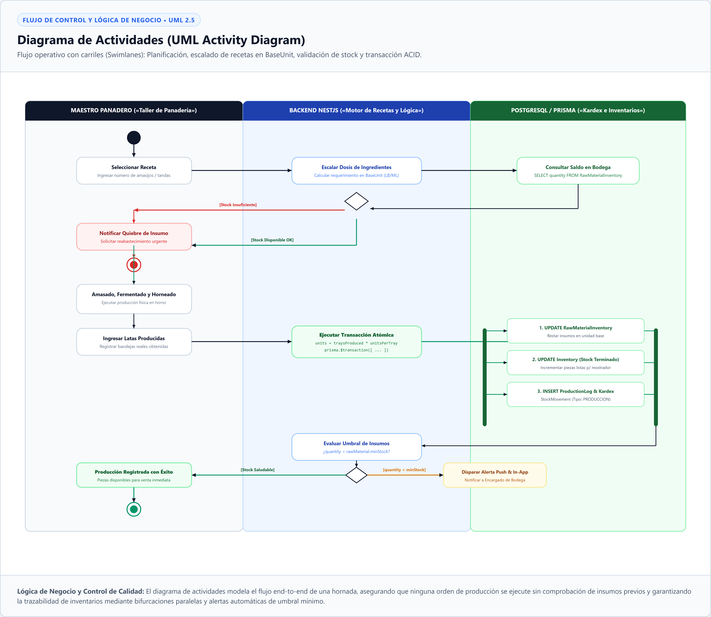
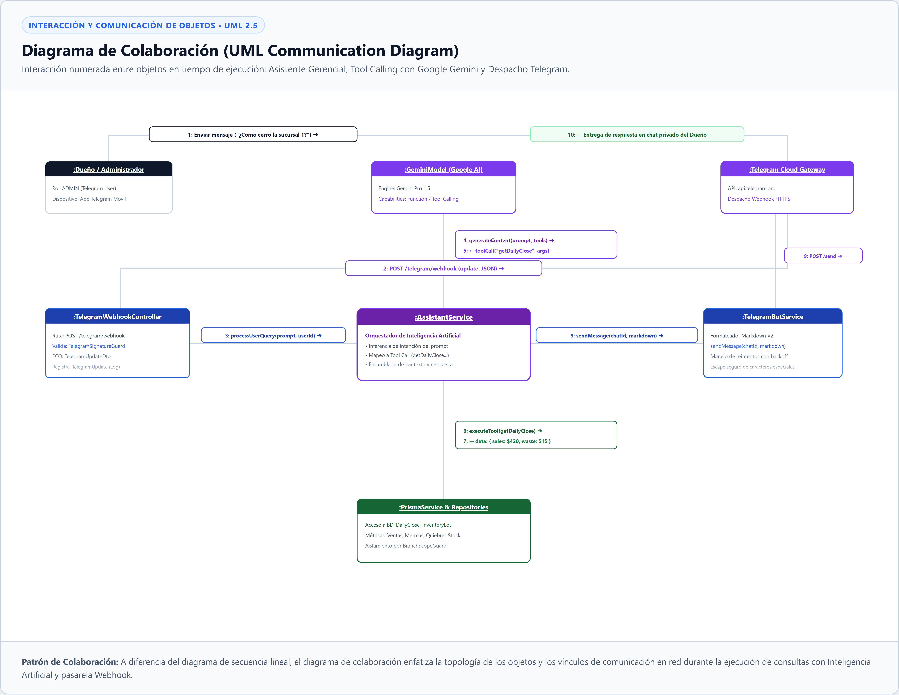
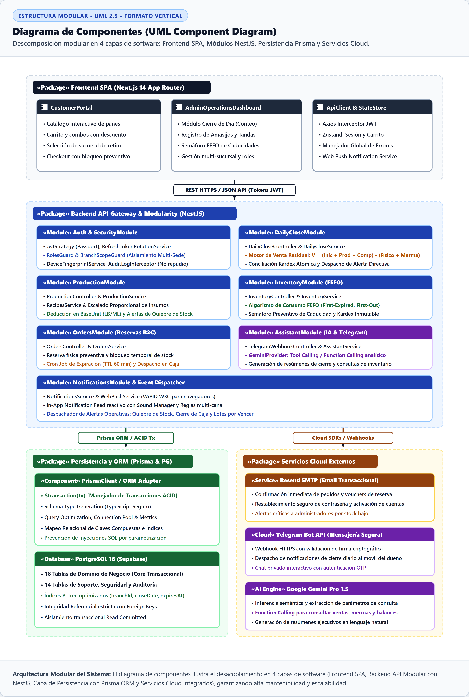

# Especificación Técnica de los Diagramas UML del Sistema

> **Documento Técnico para Memoria de Tesis / Proyecto de Graduación**  
> **Sistema:** Plataforma Web Integral de Gestión Operativa, Inventarios, Reservas e Inteligencia de Negocio — *Panadería Svetlana*  
> **Estándar de Notación:** UML 2.5 (*Unified Modeling Language*)  
> **Enfoque de Diseño:** Arquitectura Modular Orientada a Objetos, Inversión de Control (IoC), Inyección de Dependencias y Patrón Transaccional ACID  
> **Formato de Citas y Figuras:** Normas APA 7.ª edición  

---

## 1. Introducción y Marco de Modelado

El modelado visual del sistema *Panadería Svetlana* bajo el estándar **UML 2.5** proporciona una representación unificada de dos dimensiones esenciales de la ingeniería de software:
1. **Dimensión Estructural (Estática):** Modela la organización modular del código fuente, las clases, los componentes de software y la tipificación de interfaces de transferencia de datos (*Data Transfer Objects - DTOs*).
2. **Dimensión Comportamental y Dinámica:** Modela la cronología de ejecución de procesos críticos, las transiciones de estado de las entidades de negocio, el flujo de actividades operativas en taller y la topología de colaboración entre microservicios y agentes de Inteligencia Artificial (IA).

A continuación, se especifican detalladamente los 6 diagramas UML fundamentales que componen la arquitectura del software.

---

## 2. Diagrama de Clases (UML Class Diagram)

### 2.1. Descripción y Patrones de Diseño
El Diagrama de Clases describe la organización orientada a objetos de la API REST construida sobre **NestJS** y **TypeScript**. Refleja los principios SOLID, particularmente la *Responsabilidad Única* (*Single Responsibility Principle*) y la *Inyección de Dependencias* (*Dependency Injection - IoC*). La capa de controladores delega la lógica de dominio en servicios inyectables (`@Injectable()`), los cuales acceden a la persistencia a través del adaptador ORM `PrismaService`, garantizando la ejecución de transacciones atómicas mediante `PrismaService.$transaction()`.

### 2.2. Representación Gráfica (APA 7)

**Figura 3**  
*Diagrama de Clases UML: Arquitectura en Capas de Controladores, Servicios, DTOs y Persistencia ORM*

> **Nota.** Diagrama de clases estructural bajo UML 2.5. Ilustra las dependencias e inyecciones de control entre `DailyCloseController`, `ProductionController`, `OrdersController` y `TelegramWebhookController` hacia sus respectivos servicios de lógica de negocio (`DailyCloseService`, `ProductionService`, `InventoryService`, `AssistantService`), los interceptores de seguridad (`BranchScopeGuard`, `RolesGuard`), los DTOs de validación declarativa y el adaptador de base de datos `PrismaService`.  
> *Fuente: Elaboración propia (2026).*

### 2.3. Especificación de Clases y Métodos Principales

**Tabla 3**  
*Especificación Técnica de Clases del Sistema*

| Clase / Componente | Estereotipo | Métodos Principales | Responsabilidad Técnica |
|---|---|---|---|
| `DailyCloseController` | `«Controller»` | `getPreview()`, `confirmClose()`, `getHistory()` | Expone endpoints REST protegidos con `@UseGuards(JwtAuthGuard, RolesGuard, BranchScopeGuard)` para la conciliación de cierre de día. |
| `DailyCloseService` | `«Injectable»` | `calculateResidualSale()`, `getClosePreview()`, `executeAtomicClose()` | Calcula la venta residual basada en la fórmula $V = (\text{Inicial} + \text{Producción} + \text{Compras}) - (\text{Conteo Físico} + \text{Mermas})$ y persiste el cierre atómico. |
| `ProductionService` | `«Injectable»` | `recordBatchProduction()`, `scaleRecipeIngredients()`, `validateRawMaterialStock()` | Escala las recetas a las latas producidas, valida stock de materias primas y deduce insumos en `BaseUnit` (`LB`, `ML`, `UNIT`). |
| `InventoryService` | `«Injectable»` | `reserveStock()`, `releaseReservation()`, `consumeLotsFEFO()`, `getExpiryStatusSemaphore()` | Administra los saldos físicos y reservas de mostrador, aplicando el algoritmo FEFO (*First-Expired, First-Out*) sobre la entidad `InventoryLot`. |
| `AssistantService` | `«Injectable»` | `processUserQuery()`, `executeToolCall()`, `queryDailySalesTool()`, `queryCriticalStockTool()` | Orquesta la inferencia semántica con el modelo LLM Google Gemini Pro 1.5 y ejecuta llamadas a funciones (*Tool Calling*) aisladas por sucursal. |
| `PrismaService` | `«ORM Adapter»` | `$transaction()`, `onModuleInit()`, `onModuleDestroy()` | Extiende `PrismaClient` proveyendo un pool de conexiones optimizado para PostgreSQL y mecanismos de ejecución transaccional ACID. |

---

## 3. Diagrama de Secuencia (UML Sequence Diagram)

### 3.1. Descripción del Flujo Temporal
El Diagrama de Secuencia modela la interacción cronológica entre el Administrador de Tienda, el navegador web (SPA), el Gateway API de NestJS, el servicio de cierre nocturno y la base de datos PostgreSQL durante el proceso de **Cierre Diario de Caja y Conciliación de Venta Residual**. 

El diagrama ilustra cómo las operaciones críticas se encapsulan dentro de una transacción interactiva `prisma.$transaction()`, asegurando que el incremento de venta residual, la deducción de mermas y la inserción del sello inmutable en el Kardex se completen exitosamente o se reviertan en su totalidad (*Rollback*).

### 3.2. Representación Gráfica (APA 7)

**Figura 4**  
*Diagrama de Secuencia UML: Flujo Transaccional de Cierre de Día y Conciliación Atómica*

> **Nota.** Diagrama de secuencia temporal bajo UML 2.5 con barras de activación y bloque transaccional delimitado (`group: prisma.$transaction`). Muestra el flujo completo desde la captura del conteo físico en la interfaz de usuario, la validación de roles y permisos por sucursal, la ejecución del algoritmo de venta residual en el backend y la confirmación final de inventario.  
> *Fuente: Elaboración propia (2026).*

### 3.3. Trazabilidad de Mensajes e Interacciones

**Tabla 4**  
*Cronología de Mensajes del Diagrama de Secuencia*

| Paso | Emisor | Receptor | Mensaje / Operación | Descripción y Regla de Negocio |
|---|---|---|---|---|
| 1 | Administrador | Frontend SPA | `Ingresa conteo físico y mermas` | El usuario digita el conteo manual de bandejas sobrantes al final de la jornada. |
| 2 | Frontend SPA | API Gateway | `POST /daily-close/confirm` | Envío de payload JSON tipificado mediante `ConfirmDailyCloseDto`. |
| 3 | API Gateway | `DailyCloseService` | `executeAtomicClose(dto)` | Delegación interna de la petición tras superar las barreras de autenticación JWT y `BranchScopeGuard`. |
| 4 | `DailyCloseService` | `PrismaService` | `$transaction([tx])` | Apertura formal del bloque de aislamiento transaccional en PostgreSQL. |
| 5 | Transacción `tx` | PostgreSQL | `SELECT snapshot balances` | Lectura bloqueante de saldos del día para evitar condiciones de carrera (*Race Conditions*). |
| 6 | Transacción `tx` | PostgreSQL | `INSERT INTO "DailyClose"` | Creación del registro principal del cierre diario. |
| 7 | Transacción `tx` | PostgreSQL | `INSERT INTO "DailyCloseItem"` | Detalle por producto con desglose de cantidades iniciales, conteo físico, merma y venta calculada. |
| 8 | Transacción `tx` | PostgreSQL | `UPDATE "Inventory"` | Ajuste forzoso del inventario físico para igualar exactamente el conteo físico verificado. |
| 9 | Transacción `tx` | PostgreSQL | `INSERT INTO "StockMovement"` | Registro de movimientos de auditoría en Kardex de tipos `VENTA_RESIDUAL` y `MERMA`. |
| 10 | `PrismaService` | `DailyCloseService` | `Commit Transaction OK` | Confirmación de persistencia atómica en la base de datos. |
| 11 | `DailyCloseService` | Frontend SPA | `201 Created { dailyCloseId }` | Respuesta HTTP exitosa con el resumen consolidado para visualización e impresión. |

---

## 4. Diagrama de Estados (UML State Machine Diagram)

### 4.1. Descripción de las Máquinas de Estado
El Diagrama de Estados modela el ciclo de vida reactivo de dos componentes dinámicos clave del sistema:
1. **Máquina de Estados de Órdenes de Reserva (`OrderStatus`):** Controla las transiciones desde que un cliente genera un pedido en la tienda virtual hasta su retiro físico en sucursal o su caducidad automática por límite de tiempo (*Time-to-Live* de 60 minutos mediante cron job).
2. **Máquina de Estados de Lotes de Inventario (`InventoryLot` / Semáforo FEFO):** Clasifica los lotes en tres estados cromáticos (*VERDE: Óptimo*, *AMARILLO: Próximo a Caducar*, *ROJO: Vencido / Merma*) para priorizar su consumo antes de que generen pérdidas financieras.

### 4.2. Representación Gráfica (APA 7)

**Figura 5**  
*Diagrama de Estados UML: Ciclo de Vida de Reservas B2C y Semáforo Preventivo de Lotes FEFO*

> **Nota.** Diagrama de máquina de estados bajo UML 2.5 dividido en dos paneles de comportamiento. El panel superior describe los estados del pedido (`PENDING`, `CONFIRMED`, `READY`, `PICKED_UP`, `CANCELLED`) con gestión de reversión de reservas de stock; el panel inferior modela el semáforo de frescura de lotes y el descuento automatizado por algoritmo FEFO.  
> *Fuente: Elaboración propia (2026).*

### 4.3. Matriz de Transiciones y Eventos

**Tabla 5**  
*Matriz de Transiciones de Estado del Negocio*

| Entidad | Estado Origen | Evento / Disparador | Condición de Guarda | Estado Destino | Acción del Sistema |
|---|---|---|---|---|---|
| `Order` | `[Inicio]` | `createReservation()` | Stock disponible $\ge$ solicitado | `PENDING` | Bloquea unidades en `Inventory.reserved`. |
| `Order` | `PENDING` | `confirmOrder()` | Aceptado por encargado | `CONFIRMED` | Envía notificación push / correo al cliente. |
| `Order` | `CONFIRMED` | `markReady()` | Horneada lista en mostrador | `READY` | Inicia temporizador de retiro en sucursal. |
| `Order` | `READY` | `markPickedUp()` | Cliente retira y cancela en caja | `PICKED_UP` | Descuenta saldo en `Inventory` y libera `reserved`. |
| `Order` | `PENDING / READY` | `cancelOrder() / cronExpiry` | Tiempo expirado ($> 60\text{ min}$) | `CANCELLED` | Libera unidades retenidas en `Inventory.reserved`. |
| `InventoryLot` | `[Producción]` | `recordBatchProduction()` | Lote recién horneado | `VERDE (Óptimo)` | Disponible para venta regular. |
| `InventoryLot` | `VERDE` | `cronAudit` / fecha actual | $\text{Fecha actual} \ge \text{alertAt}$ | `AMARILLO (Alerta)` | Prioridad en despacho y alerta a personal. |
| `InventoryLot` | `AMARILLO` | `cronAudit` / fecha actual | $\text{Fecha actual} > \text{expiresAt}$ | `ROJO (Caducado)` | Bloqueado para venta; traslado a merma contable. |

---

## 5. Diagrama de Actividades (UML Activity Diagram)

### 5.1. Descripción y Carriles de Responsabilidad (*Swimlanes*)
El Diagrama de Actividades representa el flujo de trabajo operacional de **Registro de Hornada y Producción**, distribuyendo las responsabilidades en tres carriles (*swimlanes*):
1. **Maestro Panadero (Taller de Panadería):** Responsable de la selección de recetas, el pesaje físico, amasado, horneado e ingreso final de bandejas/piezas obtenidas.
2. **Backend NestJS (Motor de Lógica y Recetas):** Realiza el cálculo matemático de escalado proporcional de insumos, verifica la disponibilidad en bodega y evalúa umbrales de stock mínimo.
3. **PostgreSQL / Prisma (Kardex y Base de Datos):** Ejecuta la transacción ACID interactiva que actualiza inventarios de materias primas, productos terminados y asientos contables de forma simultánea.

### 5.2. Representación Gráfica (APA 7)

**Figura 6**  
*Diagrama de Actividades UML: Flujo Operativo de Hornada, Escalado de Recetas y Descuento Atómico*

> **Nota.** Diagrama de actividades bajo UML 2.5 organizado en 3 carriles de responsabilidad (*Swimlanes*). Contiene nodos de decisión para control de quiebre de insumos, nodos de bifurcación (*Fork*) y sincronización (*Join*) para actualizaciones paralelas en base de datos, y emisión de alertas push por bajo stock.  
> *Fuente: Elaboración propia (2026).*

### 5.3. Especificación del Flujo de Actividades

**Tabla 6**  
*Secuencia Operativa del Diagrama de Actividades*

| Carril (*Swimlane*) | Actividad / Decisión | Entradas / Parámetros | Salidas / Efectos |
|---|---|---|---|
| **Maestro Panadero** | `Seleccionar Receta` | ID de receta, número de amasijos / tandas | Parámetros enviados a la API. |
| **Backend NestJS** | `Escalar Dosis de Ingredientes` | Cantidad estándar $\times$ número de tandas | Requerimiento calculado en `BaseUnit` (`LB`/`ML`). |
| **PostgreSQL / Prisma** | `Consultar Saldo en Bodega` | Consulta a `RawMaterialInventory` | Saldo actual disponible. |
| **Backend NestJS** | `¿Stock Insumos Disponible?` | Comparación: $\text{Saldo} \ge \text{Requerido}$ | Bifurcación: Continuar o abortar por quiebre. |
| **Maestro Panadero** | `Amasado, Fermentado y Horneado` | Acción física de taller | Bandejas horneadas en bandejero. |
| **Maestro Panadero** | `Ingresar Latas Producidas` | Conteo de latas obtenidas | Envío de DTO de confirmación. |
| **PostgreSQL / Prisma** | `Ejecutar Transacción Atómica` | `prisma.$transaction([tx])` | **Fork Paralelo:** 1. Deducción en `RawMaterialInventory` 2. Incremento en `Inventory` 3. Inserción en `ProductionLog` y `StockMovement`. |
| **Backend NestJS** | `Evaluar Umbral de Insumos` | $\text{Saldo remanente} < \text{minStock}$ | Disparo de alerta push/in-app si se vulnera el stock de seguridad. |

---

## 6. Diagrama de Colaboración (UML Communication Diagram)

### 6.1. Descripción de la Topología de Mensajería
A diferencia del diagrama de secuencia cronológico lineal, el Diagrama de Colaboración (o de Comunicación) enfatiza la **topología de la red de objetos** y los canales de comunicación durante la ejecución del **Asistente Gerencial con Inteligencia Artificial (Google Gemini) y Despacho por Telegram**.

Ilustra cómo una consulta en lenguaje natural enviada desde la aplicación móvil de mensajería del Dueño de la panadería navega por el controlador webhook, es interpretada por el orquestador de IA para invocar herramientas de base de datos (*Function Calling*), y retorna en formato Markdown V2 enriquecido.

### 6.2. Representación Gráfica (APA 7)

**Figura 7**  
*Diagrama de Colaboración UML: Topología e Interacción del Asistente IA, Tool Calling y Telegram Webhook*

> **Nota.** Diagrama de colaboración bajo UML 2.5 que modela la topología de objetos y mensajes numerados ($1 \rightarrow 10$) entre el Dueño de negocio, el gateway Telegram Cloud, el controlador webhook seguro con firma criptográfica, el servicio `AssistantService`, el motor Gemini Pro 1.5 y el repositorio `PrismaService`.  
> *Fuente: Elaboración propia (2026).*

### 6.3. Desglose de Mensajes del Diagrama de Colaboración

**Tabla 7**  
*Mapeo Topológico de Mensajes del Asistente IA*

| N.º | Enlace / Conexión de Red | Firma del Mensaje | Tipo de Comunicación |
|---|---|---|---|
| **1** | Dueño $\rightarrow$ Telegram Cloud Gateway | `Enviar mensaje ("¿Cómo cerró la sucursal 1 hoy?")` | HTTPS / Protocolo MTProto Telegram |
| **2** | Telegram Cloud $\rightarrow$ `TelegramWebhookController` | `POST /telegram/webhook (update: JSON)` | Webhook HTTPS público con firma |
| **3** | `TelegramWebhookController` $\rightarrow$ `AssistantService` | `processUserQuery(prompt, userId)` | Invocación de método síncrono interno |
| **4** | `AssistantService` $\rightarrow$ `GeminiModel` | `generateContent(prompt, tools: ToolDeclaration[])` | Llamada a API REST Google Gemini Pro 1.5 |
| **5** | `GeminiModel` $\rightarrow$ `AssistantService` | `toolCall("getDailyClose", { branchId: 1, date: "today" })` | Respuesta de llamada a función estructurada |
| **6** | `AssistantService` $\rightarrow$ `PrismaService & Repositories` | `executeTool(getDailyClose, branchId=1)` | Consulta SQL optimizada sobre PostgreSQL |
| **7** | `PrismaService` $\rightarrow$ `AssistantService` | `data: { totalSales: $420.00, waste: $15.50, items: 8 }` | Retorno de conjunto de datos crudo |
| **8** | `AssistantService` $\rightarrow$ `TelegramBotService` | `sendMessage(chatId, markdownFormattedSummary)` | Formateo en sintaxis Markdown V2 |
| **9** | `TelegramBotService` $\rightarrow$ `Telegram Cloud Gateway` | `POST https://api.telegram.org/bot<TOKEN>/sendMessage` | Despacho HTTP con reintentos y retroceso exponencial |
| **10** | Telegram Cloud Gateway $\rightarrow$ Dueño | `Entrega de mensaje estructurado en pantalla del móvil` | Renderizado interactivo en el cliente del usuario |

---

## 7. Diagrama de Componentes (UML Component Diagram)

### 7.1. Descripción y Arquitectura de Módulos
El Diagrama de Componentes describe la estructura modular del sistema y su organización física en cuatro paquetes (*packages*) independientes y desacoplados:
1. **«Package» Frontend SPA (Next.js 14 App Router):** Interfaz de usuario que incluye el portal público de clientes, el panel de control administrativo y el gestor de estado global con Zustand y Axios.
2. **«Package» Backend API Gateway & Modularity (NestJS):** Núcleo del servidor dividido en módulos temáticos con inyección de dependencias (`AuthModule`, `DailyCloseModule`, `ProductionModule`, `InventoryModule`, `OrdersModule`, `TelegramBotModule`, `AssistantModule`, `NotificationsModule`).
3. **«Package» Persistencia y ORM (Prisma & PostgreSQL):** Capa de datos que gestiona el cliente tipificado de Prisma, las transacciones atómicas `$transaction()` y el almacenamiento en Supabase.
4. **«Package» Servicios Cloud Externos:** Proveedores SaaS integrados para entrega transaccional de correos (Resend SMTP), mensajería instantánea gerencial (Telegram Bot API) e Inteligencia Artificial generativa (Google Gemini API).

### 7.2. Representación Gráfica (APA 7)

**Figura 8**  
*Diagrama de Componentes UML: Descomposición Modular de la Arquitectura de Software en 4 Capas*

> **Nota.** Diagrama de componentes bajo UML 2.5 que expone la separación de responsabilidades y las interfaces de comunicación (REST HTTPS, WebSockets, Drivers SQL y SDKs Cloud) entre los subsistemas cliente, servidor, persistencia y servicios de terceros.  
> *Fuente: Elaboración propia (2026).*

### 7.3. Especificación de Componentes e Interfaces

**Tabla 8**  
*Catálogo de Componentes y Puertos de Comunicación*

| Paquete Arquitectónico | Componente / Módulo | Interfaz Provista / Consumida | Propósito y Responsabilidad |
|---|---|---|---|
| **Frontend SPA** | `CustomerPortal` & `AdminDashboard` | REST HTTPS / JSON API | Páginas dinámicas React con renderizado híbrido (SSR/CSR) e hidratación reactiva. |
| **Frontend SPA** | `ApiClient` | `AxiosInstance` (Interceptors) | Inyección de cabeceras `Authorization: Bearer <JWT>`, auto-refresco de tokens y manejo global de errores. |
| **Backend NestJS** | `Auth & SecurityModule` | `JwtStrategy`, `RolesGuard`, `BranchScopeGuard` | Autenticación basada en tokens, control de acceso por roles (RBAC) y aislamiento multi-sede. |
| **Backend NestJS** | `DailyCloseModule` | `IDailyCloseService` | Cálculo inmutable de ventas residuales nocturnas y conciliación de mermas. |
| **Backend NestJS** | `InventoryModule` | `IInventoryService` | Control de stock físico en mostrador y gestión de caducidades mediante semáforo FEFO. |
| **Backend NestJS** | `AssistantModule` | `IAssistantService` | Inferencia semántica y ejecución de consultas de negocio con Google Gemini. |
| **Persistencia** | `PrismaClient` / PostgreSQL | `PrismaService.$transaction` | ORM de acceso a datos con tipado seguro en tiempo de compilación e índices B-Tree optimizados. |
| **Cloud Externo** | `Resend SMTP` | `POST https://api.resend.com/emails` | Notificación de confirmación de pedidos y restablecimiento seguro de credenciales. |
| **Cloud Externo** | `Telegram Bot API` | `POST /sendMessage`, Webhooks HTTPS | Canal de comunicación bidireccional en tiempo real para alertas y asistente gerencial. |
| **Cloud Externo** | `Google Gemini API` | `@google/generative-ai` SDK | Motor de razonamiento de lenguaje natural y ejecución de herramientas analíticas. |

---

## 8. Conclusiones y Cumplimiento de Buenas Prácticas

La elaboración del conjunto integral de 6 diagramas UML (*Clases, Secuencia, Estados, Actividades, Colaboración y Componentes*) demuestra la robustez del diseño del software para *Panadería Svetlana*, garantizando los siguientes atributos de calidad:

1. **Mantenibilidad y Alta Cohesión:** La arquitectura en capas de NestJS y la clara delimitación de módulos en el diagrama de componentes aseguran que cada módulo evolucione de manera independiente sin efectos colaterales.
2. **Integridad Transaccional ACID:** Los diagramas de clases, secuencia y actividades evidencian cómo las operaciones críticas de producción y cierre de caja se protegen mediante transacciones atómicas (`prisma.$transaction()`).
3. **Escalabilidad y Seguridad:** El diagrama de clases y componentes certifica la implementación de defensas en profundidad (*Guards*, *Interceptors*, tokens JWT y segregación multi-sucursal lógica).
4. **Innovación Operativa:** Los diagramas de colaboración y estados documentan la integración exitosa de Inteligencia Artificial para la toma de decisiones gerenciales y la optimización de desperdicios mediante el algoritmo FEFO.

---

> **Fin del Documento de Especificación UML**  
> *Para consultar las fuentes interactivas y diagramas vectoriales en alta resolución, remítase a la carpeta `documentation/diagramas/` del repositorio.*
