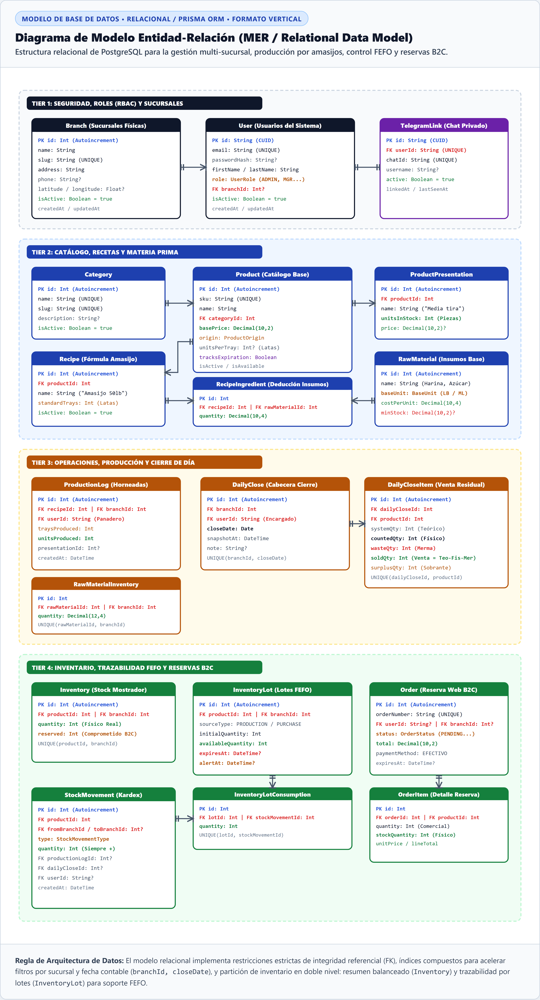

# Especificación del Diagrama de Modelo Entidad-Relación (MER)

> **Documento Técnico para Memoria de Tesis / Proyecto de Graduación**  
> **Sistema:** Plataforma Web de Gestión Operativa, Inventario y Reservas — *Panadería Svetlana*  
> **Motor de Persistencia:** PostgreSQL 16 / Prisma ORM  
> **Estándar de Modelado:** Modelo Entidad-Relación Físico / Notación Pata de Gallo (Crow's Foot)  
> **Formato de Citas y Figuras:** Normas APA 7.ª edición  

---

## 1. Justificación y Arquitectura de Persistencia

El diseño de la base de datos relacional de la plataforma *Panadería Svetlana* fue modelado en **Tercera Forma Normal (3FN)** para garantizar consistencia transaccional, integridad referencial y aislamiento por sucursal física (*Multi-Tenant Logical Partitioning*).

El esquema responde a tres desafíos computacionales específicos del negocio panadero:
1. **Doble Nivel de Inventario:** Coexistencia de un resumen balanceado en tiempo real (`Inventory` por sucursal) y un registro histórico particionado por lotes (`InventoryLot` y `InventoryLotConsumption`) para la aplicación estricta del algoritmo **FEFO** (*First-Expired, First-Out*).
2. **Escalado Proporcional de Recetas:** Conversión de unidades de compra a unidades base normalizadas (`BaseUnit`: LB para sólidos, ML para líquidos y UNIT para discretos) mediante la entidad intermedia `RecipeIngredient`.
3. **Conciliación de Venta Residual:** Registro inmutable del balance nocturno (`DailyClose` y `DailyCloseItem`) que genera movimientos contables atómicos (`StockMovement`) vinculados a transacciones ACID.

---

## 2. Representación Gráfica (APA 7)

**Figura 1**  
*Diagrama de Modelo Entidad-Relación: Estructura Físico-Relacional de la Base de Datos PostgreSQL*

> **Nota.** Diagrama de modelo entidad-relación (*Entity-Relationship Diagram*) en notación Pata de Gallo (*Crow's Foot*), estructurado en cuatro dominios funcionales: *Seguridad y Sucursales*, *Catálogo y Materias Primas*, *Operaciones y Cierre Residual*, y *Trazabilidad FEFO y Reservas B2C*. Detalla las llaves primarias (PK), foráneas (FK), tipos de datos y cardinalidades ($1:1$, $1:N$).  
> *Fuente: Elaboración propia (2026).*

---

## 3. Diccionario de Datos y Especificación de Entidades

**Tabla 1**  
*Especificación de Entidades Principales del Modelo Relacional*

| Dominio | Entidad | Clave Primaria (PK) | Claves Foráneas (FK) | Propósito y Reglas de Negocio Asociadas |
|---|---|---|---|---|
| **Seguridad & Sedes** | `User` | `id` (String CUID) | `branchId` $\rightarrow$ `Branch(id)` | Usuarios del sistema (`ADMIN`, `MANAGER`, `BAKER`, `CUSTOMER`). Soporta autenticación con contraseña hash (Bcrypt) y vinculación multi-sucursal. |
| **Seguridad & Sedes** | `Branch` | `id` (Int Autoincrement) | — | Sedes físicas operativas. Particiona inventarios, cierres contables y personal operativo. |
| **Seguridad & Sedes** | `TelegramLink` | `id` (String CUID) | `userId` $\rightarrow$ `User(id)` [1:1] | Vincula el `chatId` privado del dueño con su cuenta directiva para consultas seguras mediante IA. |
| **Catálogo** | `Category` | `id` (Int Autoincrement) | — | Agrupación taxonómica de productos para catálogo público y administración. |
| **Catálogo** | `Product` | `id` (Int Autoincrement) | `categoryId` $\rightarrow$ `Category(id)` | Productos comercializados. Define origen (`PRODUCIDO` / `COMPRADO`), precio base, latas de amasijo y activación de caducidad. |
| **Catálogo** | `ProductPresentation` | `id` (Int Autoincrement) | `productId` $\rightarrow$ `Product(id)` | Presentaciones comerciales (ej. "Media tira" = 3 piezas, "Tira completa" = 6 piezas). |
| **Materia Prima** | `RawMaterial` | `id` (Int Autoincrement) | — | Insumos de producción (harina, manteca, levadura). Normalizados en `BaseUnit` (`LB`, `ML`, `UNIT`). |
| **Materia Prima** | `RawMaterialInventory` | `id` (Int Autoincrement) | `rawMaterialId`, `branchId` | Existencias de materias primas por sucursal. Restricción única compuesta `(rawMaterialId, branchId)`. |
| **Producción** | `Recipe` | `id` (Int Autoincrement) | `productId` $\rightarrow$ `Product(id)` | Formulación de horneada estándar (ej. Amasijo de 50 lb de harina rinde 33 latas). |
| **Producción** | `RecipeIngredient` | `id` (Int Autoincrement) | `recipeId`, `rawMaterialId` | Desglose de insumos y cantidades base requeridas por cada horneada estándar. |
| **Producción** | `ProductionLog` | `id` (Int Autoincrement) | `recipeId`, `branchId`, `userId` | Evento inmutable de horneado: deduce insumos en `RawMaterialInventory` e incrementa el stock terminado en `Inventory`. |
| **Cierre Diario** | `DailyClose` | `id` (Int Autoincrement) | `branchId`, `userId` | Sello contable nocturno por fecha y sede. Restricción única `(branchId, closeDate)`. |
| **Cierre Diario** | `DailyCloseItem` | `id` (Int Autoincrement) | `dailyCloseId`, `productId` | Comparativo de cierre: saldo teórico (`systemQty`), conteo físico (`countedQty`), mermas (`wasteQty`) y venta residual (`soldQty`). |
| **Inventario** | `Inventory` | `id` (Int Autoincrement) | `productId`, `branchId` | Stock físico consolidado y unidades comprometidas (`reserved`) por pedidos en línea. |
| **Trazabilidad** | `InventoryLot` | `id` (Int Autoincrement) | `productId`, `branchId` | Lotes de producto con fecha de vencimiento (`expiresAt`) y fecha de alerta preventiva (`alertAt`). |
| **Kardex** | `StockMovement` | `id` (Int Autoincrement) | `productId`, `fromBranchId`, `toBranchId`, `productionLogId`, `dailyCloseId` | Kardex inmutable de entradas y salidas (`PRODUCCION`, `COMPRA`, `VENTA`, `MERMA`, `TRANSFERENCIA`). |
| **Trazabilidad** | `InventoryLotConsumption` | `id` (Int Autoincrement) | `lotId`, `stockMovementId` | Registro de auditoría que vincula el consumo físico de un lote específico con un movimiento del kardex. |
| **Reservas B2C** | `Order` | `id` (Int Autoincrement) | `userId`, `branchId` | Órdenes de reserva con recogida en tienda. Estados: `PENDING`, `CONFIRMED`, `READY`, `PICKED_UP`, `CANCELLED`. |
| **Reservas B2C** | `OrderItem` | `id` (Int Autoincrement) | `orderId`, `productId`, `presentationId` | Líneas de detalle de la orden con cálculo de subtotal y reserva física de unidades en `Inventory`. |

---

## 4. Cardinalidades y Relaciones Críticas

1. **Relación de Sucursal y Personal ($1:N$):**  
   Una sede física (`Branch`) alberga múltiples usuarios operativos (`User`), pero cada empleado pertenece a una sede predeterminada de trabajo.
2. **Relación de Receta e Ingredientes ($1:N$ y $M:N$ resuelta):**  
   Una receta (`Recipe`) contiene múltiples ingredientes (`RecipeIngredient`), vinculando materias primas (`RawMaterial`) con sus dosis volumétricas exactas.
3. **Relación de Cierre de Día y Detalle de Productos ($1:N$):**  
   Un cierre contable (`DailyClose`) consolida una lista completa de ítems (`DailyCloseItem`), asegurando que ningún producto se compute dos veces gracias a la restricción `UNIQUE(dailyCloseId, productId)`.
4. **Relación de Movimiento de Kardex y Consumo de Lotes FEFO ($1:N$):**  
   Una salida de inventario (`StockMovement`) puede consumir unidades de uno o varios lotes ordenados por fecha de expiración (`InventoryLotConsumption`), permitiendo trazabilidad sanitaria completa.
5. **Relación de Orden y Detalle de Reserva ($1:N$):**  
   Una reserva (`Order`) desglosa sus productos en `OrderItem`, reteniendo el precio unitario y la cantidad de unidades físicas reservadas temporalmente para evitar sobreventa.
