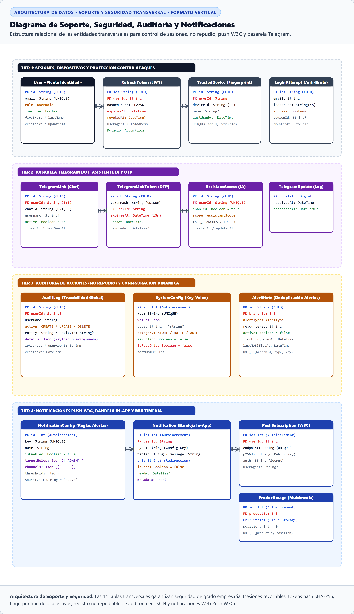

# Especificación del Modelo de Soporte, Seguridad, Auditoría y Notificaciones

> **Documento Técnico para Memoria de Tesis / Proyecto de Graduación**  
> **Sistema:** Plataforma Web de Gestión Operativa, Inventario y Reservas — *Panadería Svetlana*  
> **Área:** Arquitectura de Datos Transversal / Infraestructura y Seguridad  
> **Formato de Citas y Figuras:** Normas APA 7.ª edición  

---

## 1. Justificación Arquitectónica de la Separación de Capas

En el diseño de bases de datos para sistemas empresariales modernos, se adopta el principio de **Separación de Responsabilidades (*Separation of Concerns*)** a nivel de persistencia. En lugar de sobrecargar las entidades transaccionales del negocio (tales como *Ventas, Cierres o Producción*), la plataforma *Panadería Svetlana* implementa un **submodelo relacional de soporte transversal** encargado de resolver los requerimientos no funcionales críticos:

1. **Gestión Segura de Sesiones y Protección Perimetral:** Emisión de pares de tokens criptográficos (`AccessToken` de corta vida y `RefreshToken` opaco con hash SHA-256), reconocimiento de dispositivos de confianza (*Device Fingerprinting*) y mitigación de ataques de fuerza bruta mediante conteo de intentos (`LoginAttempt`).
2. **Trazabilidad y Principio de No Repudio:** Registro inmutable de eventos administrativos (`AuditLog`) que almacena el estado previo y posterior de las modificaciones en formato JSON estructurado sin degradar el rendimiento relacional.
3. **Centro de Notificaciones y Estándar Web Push (W3C):** Despacho omnicanal de alertas operativas (`Notification`, `NotificationConfig` y `PushSubscription`) mediante el protocolo VAPID para notificaciones de escritorio y móviles.
4. **Pasarela Segura de Mensajería e Inteligencia Artificial:** Mecanismo de enlace privado (*Handshake*) para vincular cuentas directivas de Telegram con tokens de un solo uso (`TelegramLinkToken`), registro de webhooks (`TelegramUpdate`) y políticas de acceso a llamadas a funciones (`AssistantAccess`).

---

## 2. Niveles de Tablas en el Ecosistema Supabase / PostgreSQL

**Tabla 1**  
*Clasificación y Jerarquía de Tablas en la Base de Datos del Proyecto*

| Nivel Arquitectónico | Propósito en el Sistema | Tablas Representativas | Inclusión en Documentación |
|---|---|---|---|
| **Nivel 1: Dominio de Negocio (Core Transaccional)** | Modela la operación física y comercial de la panadería: ventas, amasijos, inventario físico, algoritmo FEFO y cierre residual nocturno. | `Product`, `Order`, `InventoryLot`, `DailyClose`, `Recipe`, `Branch`, `StockMovement`. | Diagrama MER Principal (**Figura 1** en documento de Dominio). |
| **Nivel 2: Soporte, Seguridad y Auditoría (Transversal)** | Provee servicios de infraestructura: ciclo de vida JWT, auditoría de cambios, alertas push y enlace seguro con bot de Telegram. | `RefreshToken`, `TrustedDevice`, `AuditLog`, `SystemConfig`, `Notification`, `TelegramLinkToken`. | Diagrama de Soporte (**Figura 2** en el presente documento). |
| **Nivel 3: Esquemas Internos del Motor (Supabase/PostgreSQL)** | Tablas del proveedor de infraestructura cloud para autenticación federada, almacenamiento binario y webhooks de base de datos. | `auth.users`, `storage.objects`, `realtime.subscription`, extensiones `pgjwt`. | Administrado automáticamente por Supabase (Excluido de la lógica de negocio de la tesis). |

---

## 3. Representación Gráfica del Modelo de Soporte (APA 7)

**Figura 2**  
*Diagrama Relacional de Soporte, Seguridad, Auditoría y Notificaciones*

> **Nota.** Diagrama relacional de infraestructura transversal que complementa el modelo entidad-relación del núcleo de negocio. Describe las relaciones entre el pivote de identidad (*User*), las tablas de control de sesión (*RefreshToken, TrustedDevice, LoginAttempt*), la pasarela de integración con Telegram e IA (*TelegramLink, TelegramLinkToken, AssistantAccess*), el registro no repudiable de cambios (*AuditLog, SystemConfig, AlertState*) y el motor de alertas (*NotificationConfig, Notification, PushSubscription*).  
> *Fuente: Elaboración propia (2026).*

---

## 4. Diccionario de Datos de Entidades de Soporte

**Tabla 2**  
*Especificación Técnica de las Tablas de Infraestructura y Soporte*

| Dominio | Entidad | Clave Primaria (PK) | Claves Foráneas (FK) | Propósito y Comportamiento Técnico |
|---|---|---|---|---|
| **Sesiones & Seguridad** | `RefreshToken` | `id` (String CUID) | `userId` $\rightarrow$ `User(id)` | Almacena el hash SHA-256 del token de refresco. Permite rotación de sesiones y revocación remota individual. |
| **Sesiones & Seguridad** | `TrustedDevice` | `id` (String CUID) | `userId` $\rightarrow$ `User(id)` | Huella digital (*Fingerprint*) de navegadores y dispositivos reconocidos por el usuario para prevenir suplantación. |
| **Seguridad Perimetral** | `LoginAttempt` | `id` (String CUID) | — | Registro de intentos de autenticación por IP y correo. Habilita activación automática de retardos y captcha progresivo. |
| **Telegram & IA** | `TelegramLinkToken` | `id` (String CUID) | `userId` $\rightarrow$ `User(id)` | Token OTP temporal de alta entropía para vincular de forma segura la cuenta del dueño con el bot de Telegram. |
| **Telegram & IA** | `TelegramUpdate` | `updateId` (BigInt) | — | Bitácora de solicitudes entrantes vía Webhook para garantizar idempotencia y evitar procesamiento duplicado. |
| **Telegram & IA** | `TelegramLinkAttempt` | `id` (String CUID) | — | Auditoría de intentos no autorizados de interacción con el bot administrativo. |
| **Telegram & IA** | `AssistantAccess` | `id` (String CUID) | `userId` $\rightarrow$ `User(id)` [1:1] | Bandera de autorización y alcance operativo (`ALL_BRANCHES`) para consultas del asistente de IA. |
| **Auditoría Global** | `AuditLog` | `id` (String CUID) | `userId` $\rightarrow$ `User(id)` | Bitácora de no repudio. Captura entidad modificada, acción (`CREATE`, `UPDATE`, `DELETE`), IP y payload estructurado en columna `details: Json`. |
| **Configuración** | `SystemConfig` | `id` (Int Autoincrement) | — | Almacén dinámico tipado de parámetros globales (`STORE`, `ORDERS`, `OPERATIONS`) editables sin reiniciar el servidor. |
| **Monitoreo** | `AlertState` | `id` (String CUID) | `branchId` $\rightarrow$ `Branch(id)` | Máquina de estados para evitar duplicación de notificaciones recurrentes de stock bajo o caducidades inminentes. |
| **Centro de Alertas** | `NotificationConfig` | `id` (Int Autoincrement) | — | Reglas configurables de notificación: roles objetivo (`targetRoles`), canales (`channels`) y umbrales volumétricos (`thresholds`). |
| **Notificaciones** | `Notification` | `id` (Int Autoincrement) | `userId` $\rightarrow$ `User(id)` | Bandeja in-app individual con estado de lectura (`isRead`, `readAt`) y redirección operativa (`url`). |
| **Web Push (W3C)** | `PushSubscription` | `id` (Int Autoincrement) | `userId` $\rightarrow$ `User(id)` | Parámetros criptográficos (`p256dh` y `auth`) para el envío de notificaciones push directas al navegador del usuario. |
| **Multimedia** | `ProductImage` | `id` (Int Autoincrement) | `productId` $\rightarrow$ `Product(id)` | Referencia a URLs de imágenes en CDN/Bucket con orden de visualización en el catálogo. |

---

## 5. Beneficios para la Sustentación de Grado

Presentar la base de datos dividida en dos modelos (Dominio vs. Soporte) ofrece ventajas técnicas contundentes:
1. **Claridad Expositiva:** El tribunal puede examinar la lógica comercial de la panadería sin distraerse en detalles de infraestructura.
2. **Defensa de Seguridad:** Demuestra cumplimiento con estándares de ciberseguridad (tokens criptográficos, no repudio y aislamiento RBAC).
3. **Escalabilidad:** Justifica el uso de columnas `Json` para configuraciones dinámicas y notificaciones desacopladas del ciclo transaccional principal.
